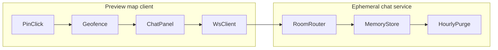

# NYCIF Phase 4 — Press Email Intake + Ephemeral Geofence Chat

Phase 4 adds two **preview-only** capabilities on top of Phase 3B precinct geofences. Nothing in Phase 4 promotes coordinates, stories, or chat history to the production public map unless a human explicitly authorizes a later promotion step.

## Prime directive

Do not publish bad data.

Phase 4 may create staging artifacts, intake queues, and ephemeral chat rooms. It must not:

- edit `data/location_cache.json`
- edit `data/nycif_staged_live_events.json`
- set `promotion_allowed` to `true` without explicit human instruction
- treat chat transcripts as durable public records
- auto-publish press-email pins to the production map

## What Phase 3 already provides

Phase 3B (`data/supplemental_press_geofence_staging.json`) already:

- assigns an NYPD precinct to **2,363** supplemental export pins
- flags **11** `press_release_candidate` rows via a conservative title/location heuristic
- publishes precinct boundary shards under `dist/nypd_precincts/precinct-*.json`
- draws a **sky-blue** (`#38bdf8`) precinct polygon on pin click in the supplemental preview map

Phase 4 builds on that geofence layer; it does not replace it.

---

## Phase 4A — Press email intake (staging only)

### Goal

Turn NYC press-list / NYPD press-release emails into **reviewable staging rows** that appear as pins at the relevant police house (or event location when known), with the same precinct geofence behavior on tap.

### Inputs (future, not wired in 3B)

| Source | Transport | Notes |
|--------|-----------|-------|
| NYPD / city press-release mailing lists | IMAP or forwarded Gmail label | Read-only fetch; no send |
| ChatGPT-assisted extraction | Optional sidecar prompt | Produces structured JSON only; never writes directly to public feed |
| Manual paste / CSV upload | Admin desk fallback | Same schema as email parse output |

### Allowed outputs

- `data/press_email_intake_raw.json` — normalized raw messages (redacted headers, body text, attachment manifest)
- `data/press_email_intake_queue.json` — parsed candidate events awaiting human review
- `data/press_email_intake_report.json` — counts, parse failures, safety flags
- `data/press_email_geofence_staging.json` — rows merged with precinct assignment (parallel to supplemental geofence schema)
- `dist/press_email_geofence_staging.json` — published read-only copy for preview map enrichment

### Row schema (extends Phase 3B geofence row)

Each queue row should preserve existing safety fields and add:

| Field | Purpose |
|-------|---------|
| `intake_id` | Stable id for this email-derived row |
| `intake_source` | `email_imap`, `email_forward`, `manual_paste`, `chatgpt_extract` |
| `intake_received_at_utc` | When the message was received |
| `email_message_id` | RFC Message-ID when available |
| `email_subject` | Original subject (for reviewer context) |
| `parsed_title` | Event / incident headline |
| `parsed_location_text` | Free-text location from email body |
| `parsed_lat` / `parsed_lng` | Nullable until geocoded or matched to precinct house |
| `pin_anchor_type` | `precinct_house`, `parsed_coordinates`, `unresolved` |
| `assigned_precinct` | From `find_precinct_for_point` or explicit NYPD metadata in email |
| `press_release_candidate` | `true` for intake rows unless reviewer demotes |
| `geofence_enabled_preview` | `true` when precinct boundary exists |
| `manual_review_status` | Starts `pending` |
| `promotion_allowed` | Always `false` in Phase 4A |
| `public_map_modified` | Always `false` in Phase 4A |
| `story_placeholder` | Short note that content is email-sourced and unapproved |

### Parse pipeline (recommended order)

1. **Fetch** — pull new messages since last cursor; store raw payload.
2. **Normalize** — strip HTML, dedupe by `Message-ID`, redact PII patterns (home addresses of victims, juvenile names) into reviewer notes instead of pin titles.
3. **Extract** — title, datetime, borough, location phrase, precinct number if present (`40th Precinct`, `PSA 4`, etc.).
4. **Resolve anchor** — prefer official precinct house coordinates from `data/nypd_precinct_boundaries_reference.json` centroid when email references a precinct without street address; otherwise geocode conservatively into staging only.
5. **Assign geofence** — reuse `tools/supplemental/precinct_geofence.py` helpers.
6. **Queue for review** — append to `press_email_intake_queue.json`; do not merge into `supplemental_approved_export_feed.json` without explicit approval script.

### Scripts (to be added)

| Script | Role |
|--------|------|
| `scripts/fetch_press_email_intake.py` | Optional network: IMAP pull → raw artifact |
| `scripts/build_press_email_intake_queue.py` | Parse raw → queue rows + report |
| `scripts/build_press_email_geofence_staging.py` | Queue → geofence staging + precinct join |
| `scripts/publish_press_email_geofence_staging.py` | Copy to `dist/` for preview consumption |

### Preview map behavior (4A)

- Load `dist/press_email_geofence_staging.json` as a **separate overlay layer** (distinct pin style from supplemental approved export).
- Default: **hidden** until reviewer enables “Press intake preview” toggle.
- On pin tap: draw the same sky-blue precinct polygon used in Phase 3B.
- Popup shows `email_subject`, `parsed_title`, `intake_received_at_utc`, and `story_placeholder`.
- Banner remains: **PREVIEW — NOT PRODUCTION**.

### Human review gate (before any merge)

A row may graduate from intake queue to supplemental export only when all are true:

- `manual_review_status` is `approved`
- `manual_reviewer` and `manual_reviewed_at_utc` are present
- `approval_decision_reason` documents the email source
- valid NYC coordinates or documented precinct-house anchor
- separate explicit instruction to merge (not implied by “review” or “stage”)

### QA artifacts

- `data/press_email_intake_report.json` must report `qa_pass: true` or list blocking failures
- Report must include: `raw_message_count`, `parsed_row_count`, `unresolved_location_count`, `precinct_assigned_count`, `redaction_count`
- CI gate: no silent drops — every raw message id appears in report disposition

---

## Phase 4B — One-hour ephemeral geofence chat (preview only)

### Goal

When a user taps a pin and the precinct geofence is visible, optionally open a **geofence-scoped chat room** that exists for one hour, stores no durable transcript, and shows anonymous presence as dots with a baby-blue heading arrow.

This is a foundation for a future mobile app built on the map; Phase 4B ships a **web preview prototype** only.

### Non-goals

- No usernames, profiles, or account system
- No permanent chat logs, search, or moderation dashboard in v1
- No production map enablement without explicit promotion
- No IP/device fingerprinting for “bans” — use soft rate limits only

### UX rules

| Element | Spec |
|---------|------|
| Room scope | Single NYPD precinct polygon (the geofence already drawn on pin click) |
| Room lifetime | 60 minutes from creation; timer shown in UI |
| Presence | Anonymous dots on map edge or list panel; no labels |
| Self indicator | Baby-blue (`#7dd3fc` / `#38bdf8` family) arrow pointing toward user's approximate bearing |
| Messages | Plain text only; max length 280 chars; no attachments in v1 |
| Identity | Ephemeral session id (random UUID in `sessionStorage`); rotates each hour |
| Wipe notice | Visible banner: “Chats are not recorded and reset every hour.” |
| Abuse handling | Rate-limit to timeout (e.g. 30s cool-down after 10 messages/min); **no permanent bans** |

### Architecture sketch



### Service options (pick one in implementation PR)

1. **Managed WebSocket room** (e.g. Ably / Partykit / Cloudflare Durable Object) with TTL = 3600s — fastest path for preview.
2. **Self-hosted Node/WS** behind GitHub Actions–deployed preview subdomain — more control, more ops.

Recommendation: start with option 1 behind a feature flag; keep message payload schema in-repo for contract tests.

### Allowed repo artifacts (Phase 4B)

- `docs/field-desk-map-deploy/shared/nycif-ephemeral-chat-v01.js` — client module (preview only)
- `data/ephemeral_chat_room_contract.json` — JSON schema for messages/presence events
- `data/ephemeral_chat_preview_report.json` — offline contract-test results
- Tests under `tools/public-map/` or `tests/ephemeral_chat/`

No chat content committed to `data/`.

### Message contract (minimal)

```json
{
  "type": "message",
  "room_key": "precinct-40",
  "session_id": "uuid",
  "body": "string",
  "sent_at_utc": "ISO-8601"
}
```

```json
{
  "type": "presence",
  "room_key": "precinct-40",
  "session_id": "uuid",
  "lat": 40.84,
  "lng": -73.89,
  "bearing_deg": 120
}
```

Server drops messages outside the room's precinct polygon (point-in-polygon check server-side).

### Safety fields (chat rows are not GPS promotion rows)

Chat modules must not set:

- `promotion_allowed: true`
- `public_map_modified: true`
- `location_cache_modified: true`

### QA checklist (4B)

- [ ] Room expires after 60 minutes; clients receive `room_closed` event
- [ ] New room starts empty; no history replay
- [ ] Rate limit returns `rate_limited` without disconnecting other users
- [ ] Banner text visible before first message send
- [ ] Geofence must be active before chat panel opens
- [ ] Feature disabled on production `index.html` until explicitly enabled

---

## Recommended implementation order

| Step | Deliverable | Touches production map? |
|------|-------------|-------------------------|
| 4A.1 | Intake schema + `build_press_email_intake_queue.py` (fixture-only) | No |
| 4A.2 | Geofence staging + dist publish | No |
| 4A.3 | Preview overlay + admin toggle | No |
| 4A.4 | Optional IMAP fetch (secrets in Actions only) | No |
| 4B.1 | Message contract + contract tests | No |
| 4B.2 | Client chat panel behind preview flag | No |
| 4B.3 | Ephemeral WS backend + hourly purge | No |
| 4B.4 | Load test + rate-limit verification | No |

## Dependencies

- `data/nypd_precinct_boundaries_reference.json` (Phase 3B)
- `tools/supplemental/precinct_geofence.py` (precinct assignment + press heuristic)
- `docs/field-desk-map-deploy/supplemental-export-preview/` (preview map host)
- Optional: SMTP/IMAP secrets for intake — **never** commit credentials

## Cross-repo notes

- Backend (`nycif-live-feeds`) owns intake artifacts and `dist/` publish paths.
- Frontend (`nycif-field-desk`) receives deployed preview JS via existing supplemental deploy workflow.
- Production public map (`index.html`) must not load press intake or chat modules until a separate promotion decision.

## What remains unapproved after Phase 4

Even when Phase 4 ships:

- Press email pins are **not** on the production public map
- Chat is **not** enabled on `nycif.com` / WordPress embed
- No changes to `location_cache.json` or Phase 2E promotion
- Email-derived stories are not factual claims until `manual_review_status: approved`

Explicit promotion language is still required for any production merge.
