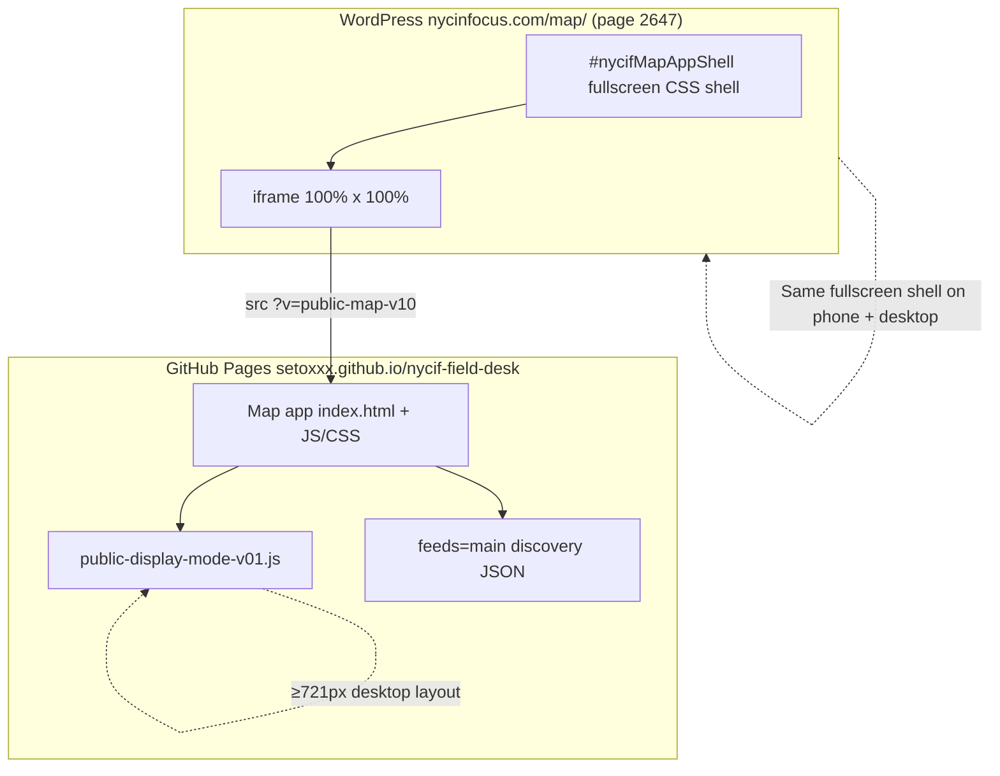

# ChatGPT / WordPress deploy runbook (in-depth)

Use this when **Cursor or GitHub** has merged map code and you need **ChatGPT, Copilot, or any agent with WordPress.com admin access** to publish https://nycinfocus.com/map/.

**Companion docs**

| Doc | What it covers |
|-----|----------------|
| [`nycinfocus-map-page-v1-freeze.md`](./nycinfocus-map-page-v1-freeze.md) | Canonical HTML shell + curl QA |
| [`PUBLIC-MAP-DISPLAY-MODES.md`](./PUBLIC-MAP-DISPLAY-MODES.md) | Mobile vs desktop layout inside the iframe |
| [`status/nycif-map-v1-freeze.json`](../../status/nycif-map-v1-freeze.json) | Machine-readable `canonical_iframe_src` |

---

## Architecture (two layers — do not confuse them)



| Layer | Who owns it | What changes on release |
|-------|-------------|-------------------------|
| **WordPress shell** | ChatGPT / human WP admin | Only iframe `src` `v=` param (and full HTML block if freeze doc changed) |
| **Map runtime** | Cursor → `nycif-live-feeds` → GitHub Actions → Field Desk Pages | JS, CSS, tip jar, mobile/desktop rules, feed wiring |

WordPress does **not** need separate mobile vs desktop HTML. The iframe is always fullscreen. The map app inside detects the device width and switches layout automatically.

---

## Release order (never skip steps)

```
1. Cursor merges PR to nycif-live-feeds main
        ↓
2. GitHub Actions "Deploy to Field Desk Pages" succeeds
        ↓
3. Verify GitHub Pages URL loads new v= token (see Pre-flight below)
        ↓
4. Paste ChatGPT prompt below → update WordPress page 2647
        ↓
5. Run curl QA on nycinfocus.com/map/
        ↓
6. Human viewport QA: desktop + mobile (checklist below)
        ↓
7. Report PASS back to Cursor / project owner
```

If step 2 has not finished, **do not** update WordPress — visitors would get a new `v=` pointing at a runtime that is not live yet.

---

## Pre-flight: confirm GitHub Pages before touching WordPress

**Current canonical `v=` token:** `public-map-v10`  
(If unsure, read `status/nycif-map-v1-freeze.json` → `surfaces.canonical_iframe_src`.)

### 1. Pages URL responds

```bash
curl -sI 'https://setoxxx.github.io/nycif-field-desk/?v=public-map-v10&resetFilters=1&feeds=main' | head -5
```

Expect `HTTP/2 200` (or `HTTP/1.1 200`).

### 2. Pages HTML contains the new cache bust

```bash
curl -sL 'https://setoxxx.github.io/nycif-field-desk/?v=public-map-v10&resetFilters=1&feeds=main' | grep -o 'public-map-v10' | head -3
```

Expect at least one `public-map-v10` line.

### 3. Display-mode script is deployed (v10+)

```bash
curl -sL 'https://setoxxx.github.io/nycif-field-desk/?v=public-map-v10&resetFilters=1&feeds=main' | grep -q 'public-display-mode-v01.js' && echo PASS display-mode-script || echo FAIL display-mode-script
```

---

## WordPress admin walkthrough (page 2647)

### Site facts

| Field | Value |
|-------|-------|
| Site | https://nycinfocus.com (WordPress.com hosted) |
| Public URL | https://nycinfocus.com/map/ |
| Page ID | **2647** |
| Template | **Blank** |
| Editor | **Code editor** only for this page |

### Step-by-step

1. Log in to WordPress.com / WP Admin for nycinfocus.com.
2. Go to **Pages** → search `map` or open page ID **2647**.
3. Confirm the page slug is `/map/` and template is **Blank**.
4. Open the **Code editor** (not Visual editor, not Site Editor blocks UI).
   - Visual editor can inject smart quotes and extra blocks that break the freeze.
5. Select **all** page content and replace with the **canonical HTML block** from the prompt below.
   - The page must contain exactly **one** Custom HTML pattern: `<style>` + `#nycifMapAppShell` + single `<iframe>`.
   - No `[nycif_events_map]` shortcode.
   - No page title block in content.
   - No `<script>` that sets `iframe.src` (smart-quote risk).
6. Click **Update** / **Publish**.
7. Open https://nycinfocus.com/map/ in a private/incognito window (avoids admin bar chrome).
8. Run automated QA (curl) and human viewport checklist below.

### SEO excerpt (if editing page settings)

```
Live NYC public events map from NYC In Focus.
```

---

## Copy/paste prompt for ChatGPT

Replace `public-map-v10` only if `status/nycif-map-v1-freeze.json` shows a newer `runtime_cache_bust`.

````
You are the NYC In Focus WordPress deploy agent. You have admin access to nycinfocus.com.

## Your mission
Publish the production public event map to https://nycinfocus.com/map/ by updating WordPress page 2647. This is a DISPLAY-ONLY change. You must not modify feeds, GPS data, or backend JSON.

## Architecture you must understand
- WordPress page = fullscreen iframe SHELL only (hides theme header/footer).
- Map UI, mobile/desktop layout, and event data live INSIDE the iframe on GitHub Pages.
- The iframe always fills 100% width and height on every device.
- Mobile vs desktop layout is automatic inside the iframe (≤720px = mobile, ≥721px = desktop). Do NOT create separate WordPress pages or separate iframes for mobile.

## Preconditions (verify before editing)
1. Confirm this URL returns 200 and contains "public-map-v10" in HTML:
   https://setoxxx.github.io/nycif-field-desk/?v=public-map-v10&resetFilters=1&feeds=main
2. If that fails, STOP and report that Field Desk Pages deploy is not ready. Do not edit WordPress.

## WordPress page contract
- Page ID: 2647
- URL: https://nycinfocus.com/map/
- Template: Blank
- Editor: Code Editor ONLY
- Content: ONE Custom HTML block — canonical shell below

## Canonical iframe src (must match exactly)
https://setoxxx.github.io/nycif-field-desk/?v=public-map-v10&resetFilters=1&feeds=main

| Param | Value | Why |
|-------|-------|-----|
| v | public-map-v10 | Cache bust for map JS/CSS on GitHub Pages |
| feeds | main | Approved public discovery feed only |
| resetFilters | 1 | Clean filter state on load |

NEVER use: feed=staged, feeds=<git-sha>, v=nycif-map-publish-02, or [nycif_events_map] shortcode on this page.

## TASK
0. (Recommended) Plugins → NYCIF Events Map → verify version **1.5.0-rc1** or upload upgrade zip from live-feeds repo `docs/wordpress-plugin-deploy/nycif-events-map/`. This fixes shortcode embeds on other pages; /map/ still uses the shell below.
1. WP Admin → Pages → page 2647 → Code Editor
2. Replace entire page content with this HTML (straight ASCII quotes " only — no curly quotes):

<style>
  html, body { margin:0 !important; padding:0 !important; height:100% !important; overflow:hidden !important; }
  body:has(#nycifMapAppShell) .nycif-template-shell > header,
  body:has(#nycifMapAppShell) .nycif-template-shell > footer,
  body:has(#nycifMapAppShell) .nycif-page-main > .wp-block-post-title,
  body:has(#nycifMapAppShell) .nycif-events-map-wrap,
  body:has(#nycifMapAppShell) .nycif-events-map-caption,
  body:has(#nycifMapAppShell) .wordads-tag,
  body:has(#nycifMapAppShell) #wpconsent-root { display:none !important; }
  body:has(#nycifMapAppShell) .nycif-page-main { max-width:none !important; margin:0 !important; padding:0 !important; }
  #nycifMapAppShell { position:fixed; inset:0; width:100%; height:100%; z-index:99999; background:#0b1117; }
  #nycifMapAppShell iframe { display:block; width:100%; height:100%; border:0; }
</style>
<div id="nycifMapAppShell">
  <iframe
    title="NYC In Focus Event Map"
    src="https://setoxxx.github.io/nycif-field-desk/?v=public-map-v10&resetFilters=1&feeds=main"
    loading="eager"
    referrerpolicy="no-referrer-when-downgrade"
    allow="geolocation; fullscreen"
    allowfullscreen></iframe>
</div>

3. Update / Publish the page.

## Automated QA (run in terminal after save)
curl -sL 'https://nycinfocus.com/map/' | python3 -c "
import sys, re
h = sys.stdin.read()
checks = [
    ('nycifMapAppShell div', bool(re.search(r'<div id=\"nycifMapAppShell\"', h))),
    ('hide rules', 'body:has(#nycifMapAppShell)' in h),
    ('public-map-v10', 'public-map-v10' in h),
    ('feeds=main', 'feeds=main' in h or 'feeds&#038;main' in h or 'feeds&amp;main' in h),
    ('no plugin wrap', not re.search(r'<div class=\"nycif-events-map-wrap\"', h)),
    ('no caption', not re.search(r'<p class=\"nycif-events-map-caption\"', h)),
    ('no shortcode text', '[nycif_events_map]' not in h),
    ('no commit pin', 'feeds=bf7dedd' not in h),
    ('no staged feed', 'feed=staged' not in h),
]
for name, ok in checks:
    print(('PASS' if ok else 'FAIL') + ' ' + name)
"

All lines must print PASS.

## Human viewport QA (required)

### Desktop (browser width ≥ 1280px)
Open https://nycinfocus.com/map/
- [ ] Map is edge-to-edge; no site header, footer, H1, or caption visible
- [ ] NYCIF brand card top-left; Filters / GPS / Bug top-right
- [ ] Week strip visible (centered/top area)
- [ ] Near Me button visible on desktop (optional RC control)
- [ ] Tip jar (heart) opens panel; Share uses https://www.nycinfocus.com/map/
- [ ] Event pins load; clicking a pin opens popup

### Mobile (phone OR DevTools ≤ 720px width)
Same URL on phone or Chrome DevTools device mode (e.g. iPhone 14):
- [ ] Still fullscreen — no WordPress chrome
- [ ] Week strip sits below brand row, does NOT overlap GPS/Filters stack
- [ ] Near Me button is HIDDEN (RC — future app feature)
- [ ] Filters panel opens and is usable
- [ ] Tip jar panel fits screen; share sheet works on iOS/Android if available
- [ ] Rotate to landscape: layout remains usable, no double scrollbars on body

### Resize test (desktop browser)
- [ ] Start wide (desktop layout) → narrow below 720px → mobile layout applies
- [ ] Widen again → desktop layout returns
- [ ] No stuck-open Event List drawer after narrowing

## DO NOT
- Add [nycif_events_map] shortcode to /map/
- Set iframe height to 85vh or add border-radius
- Pin feeds= to a commit hash
- Use JavaScript to set iframe.src (smart quotes break on WordPress)
- Promote GPS data or change location_cache.json (not in your scope)
- Load supplemental/staged feeds on feeds=main

## Report back (use this template)
```
WordPress /map/ deploy report
- Page 2647 save: SUCCESS / FAILED
- Pre-flight Pages v=public-map-v10: PASS / FAIL
- curl QA: (paste all lines)
- Desktop viewport: PASS / FAIL — notes:
- Mobile viewport: PASS / FAIL — notes:
- Resize test: PASS / FAIL — notes:
- iframe src now: (paste exact src attribute)
- Deviations from canonical HTML: none / (describe)
```
````

---

## Human viewport checklist (quick reference)

### Desktop (≥721px inside iframe)

| Check | Expected |
|-------|----------|
| WordPress chrome | Hidden — map only |
| Brand header | Top-left NYCIF card |
| Controls | Filters, GPS (⌖), Bug — top-right stack |
| Near Me | Visible on desktop (RC) |
| Week strip | Top center area |
| Intro line | “Discover public events…” visible bottom-left |
| Explore More (in Filters) | Expanded by default |
| Tip jar share URL | `https://www.nycinfocus.com/map/` |

### Mobile (≤720px inside iframe)

| Check | Expected |
|-------|----------|
| WordPress chrome | Hidden — map only |
| Week strip | Left-aligned, below brand; clear of GPS stack |
| Near Me | **Hidden** |
| Intro line | Hidden (CSS) |
| Explore More | Collapsed by default |
| Filters / Event List | Closed by default; close when rotating to mobile |
| Safe areas | No overlap with iPhone notch (safe-area-inset) |

---

## Troubleshooting

| Symptom | Likely cause | Fix |
|---------|--------------|-----|
| Site header/footer visible | `#nycifMapAppShell` missing or hide CSS stripped | Restore full canonical HTML block |
| Raw CSS text on page | CSS not inside `<style>...</style>` | Code editor: wrap CSS in style tags |
| Map is short (85vh) | `[nycif_events_map]` shortcode used | Remove shortcode; use canonical shell |
| Old map UI after deploy | iframe still has old `v=` | Bump `v=public-map-v10` in iframe src |
| Blank iframe | GitHub Pages not deployed yet | Wait for Actions; verify pre-flight URL |
| `feeds=main` FAIL in curl | WordPress encoded `&` as `&#038;` | OK if feeds=main check accounts for encoding |
| Mobile week strip overlaps GPS | Old `v=` before v09 mobile CSS | Update to `public-map-v10` |
| Smart-quote JS error | Script block set iframe src | Remove script; use static `src=` attribute |
| Tip jar shares GitHub URL | Old tip jar before v06 | Needs `public-map-v10` runtime on Pages |

---

## Rollback procedure

If production `/map/` breaks after a deploy:

1. WP Admin → page 2647 → Code Editor.
2. Change iframe `src` `v=` back to last known good token (e.g. `public-map-v07`) **only** if that runtime still exists on Pages.
3. Update page.
4. Re-run curl QA.
5. Report incident to Cursor agent with exact iframe src and curl output.

Rollback changes display shell only — it does not revert feed data.

---

## Future releases: what changes in this prompt

When Cursor ships a new map RC:

| Change type | Cursor/backend | ChatGPT/WordPress |
|-------------|----------------|-------------------|
| JS/CSS/tip jar/mobile rules | Bump `public-map-vNN` in field-desk deploy | Update iframe `v=public-map-vNN` on page 2647 |
| New feed contract | Change `feeds=` in freeze doc (rare) | Update iframe query string |
| WordPress shell CSS | Update canonical HTML in freeze doc | Replace full HTML block |
| GPS / location_cache / supplemental | Backend pipeline | **No action** unless explicit publish request |

Cursor should update this file's `v=` token and `status/nycif-map-v1-freeze.json` in the same PR that bumps the runtime.

---

## What ChatGPT cannot do (Cursor owns this)

- Edit `docs/field-desk-map-deploy/` or merge GitHub PRs
- Trigger **Deploy to Field Desk Pages** workflow
- Promote GPS rows to `location_cache.json`
- Put supplemental calendar/Parks on `feeds=main` without human approval
- Enable paid events (post-RC milestone)

---

## Related files

| File | Purpose |
|------|---------|
| `nycinfocus-map-page-v1-freeze.md` | Signed-off HTML + curl QA |
| `PUBLIC-MAP-DISPLAY-MODES.md` | Mobile/desktop behavior inside iframe |
| `status/nycif-map-v1-freeze.json` | Canonical iframe src JSON |
| `nycif-events-map/nycif-events-map.php` | Plugin **1.5.0-rc1** for in-article embeds — upgrade from 1.4.0-rc1 |
