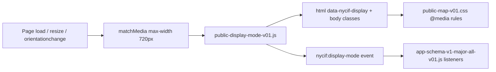

# Public map display modes (mobile vs desktop)

How the NYC In Focus public map chooses layout based on device width. Applies to the iframe app on GitHub Pages (`setoxxx.github.io/nycif-field-desk`) whether loaded from WordPress `/map/`, GitHub Pages directly, or a future native app WebView.

**WordPress note:** the WP page shell is always fullscreen on every device. All rules below run **inside the iframe**.

---

## Summary

| Mode | Width | Detection |
|------|-------|-----------|
| **Mobile** | ≤720px | `matchMedia('(max-width: 720px)')` |
| **Desktop** | ≥721px | viewport wider than 720px |

At 720px exactly, **mobile** rules apply (CSS `max-width: 720px` and JS `max-width: 720px` are aligned).

---

## Architecture



### Source files

| File | Role |
|------|------|
| `public-display-mode-v01.js` | Sets `data-nycif-display`, body classes, Explore More defaults, `NYCIF_DISPLAY_MODE` API |
| `public-map-v01.css` | Visual layout per breakpoint (week strip, Near Me, intro, popups) |
| `app-schema-v1-major-all-v01.js` | Closes Filters + Event List when switching to mobile |
| `index.html` | Loads display-mode script in `<head>` before paint |

---

## Signals exposed to CSS and JS

On every apply (load + breakpoint cross):

**`<html>`**

- `data-nycif-display="mobile"` or `"desktop"`
- class `nycif-display-mobile` or `nycif-display-desktop`

**`<body>`** (class `public-map-page`)

- same classes mirrored for legacy selectors

**JavaScript**

```javascript
// Synchronous helpers
window.NYCIF_DISPLAY_MODE.get();       // 'mobile' | 'desktop'
window.NYCIF_DISPLAY_MODE.isMobile();  // boolean
window.NYCIF_DISPLAY_MODE.isDesktop(); // boolean
window.NYCIF_DISPLAY_MODE.MOBILE_MQ; // '(max-width: 720px)'

// Event on change (resize, rotate, DevTools toggle)
window.addEventListener('nycif:display-mode', (e) => {
  console.log(e.detail.mode);   // 'mobile' | 'desktop'
  console.log(e.detail.mobile); // boolean
});
```

Use `data-nycif-display` or classes for **new** CSS. Prefer `NYCIF_DISPLAY_MODE` or the event for **new** JS (paid events, native bridge, etc.).

---

## Default layout by mode

### Desktop (≥721px) — “fullscreen desk”

| UI element | Default state |
|------------|---------------|
| Map | Full viewport, map-first |
| WordPress / page chrome | N/A inside iframe |
| NYCIF brand card | Top-left |
| Control stack | Filters, GPS, Bug, Near Me — top-right |
| Week strip (`date-chips`) | Top center (desktop positioning from base CSS) |
| Intro blurb (`.public-intro-v01`) | Visible bottom-left |
| Filters panel | Closed until user taps Filters |
| Event List drawer | Closed until user taps Event List |
| Explore More (inside Filters) | **Open** by default |
| Near Me button | **Visible** (RC; future push alerts in app) |

### Mobile (≤720px) — “fullscreen phone”

| UI element | Default state |
|------------|---------------|
| Map | Full viewport, map-first |
| Week strip | Left-aligned, `top: safe-area + 52px`, narrowed chips — **clears GPS stack** |
| Intro blurb | Hidden (`display: none` at ≤700px) |
| Near Me | **Hidden** (`#nearMeBtn { display: none }`) |
| Filters panel | Closed; opens lower (`inset-block-start: safe-area + 132px`) |
| Event List drawer | Closed |
| Explore More | **Collapsed** by default |
| On rotate to mobile | Filters + Event List **auto-close** (app listener) |

---

## CSS breakpoints (layered)

The map uses one primary breakpoint plus two helper breakpoints:

| Breakpoint | File | Purpose |
|------------|------|---------|
| **720px** | `public-map-v01.css`, `public-display-mode-v01.js` | Primary mobile/desktop split |
| 700px | `public-map-v01.css` | Reposition mode toggle / banners; hide intro |
| 500px | `public-map-v01.css` | Tighter event popups and stack picker |

When adding features, **use 720px** for mobile/desktop behavior unless there is a strong reason not to.

### Example: target mobile-only CSS

```css
/* Preferred — matches JS */
html[data-nycif-display="mobile"] body.public-map-page .my-new-control { ... }

/* Also valid — mirrors JS classes */
body.public-map-page.nycif-display-mobile .my-new-control { ... }

/* Legacy — still used throughout public-map-v01.css */
@media (max-width: 720px) {
  body.public-map-page .my-new-control { ... }
}
```

Keep JS `MOBILE_MQ` and CSS `@media (max-width: 720px)` in sync when changing the breakpoint.

---

## Runtime behavior on resize

1. User drags browser edge or rotates device.
2. `matchMedia` fires `change`.
3. `applyDisplayMode()` runs:
   - Updates `data-nycif-display` and classes.
   - Resets Explore More to mode default (collapsed mobile / open desktop).
   - Dispatches `nycif:display-mode`.
4. App listener (mobile only): `setDesk(false)`, `setLayers(false)`.

User-opened panels are not re-opened automatically when widening to desktop — avoids surprise UI.

---

## WordPress shell vs iframe layout

| Concern | WordPress page 2647 | Iframe app |
|---------|---------------------|------------|
| Fullscreen | `#nycifMapAppShell { position:fixed; inset:0 }` | Map fills iframe 100% |
| Mobile detection | **None** — same HTML for all devices | `public-display-mode-v01.js` |
| Separate m. subdomain | **Not used** | **Not needed** |
| viewport meta | Theme + iframe | `width=device-width, viewport-fit=cover` in index.html |

ChatGPT should never create a “mobile version” of the WordPress page. One page, one iframe, one URL: https://nycinfocus.com/map/

---

## QA: verifying display modes

### DevTools (Chrome)

1. Open https://nycinfocus.com/map/ (or GitHub Pages URL with same `v=`).
2. Open DevTools → toggle device toolbar.
3. Set width **390px** → confirm `document.documentElement.dataset.nycifDisplay === 'mobile'` in iframe console.
4. Set width **1280px** → confirm `'desktop'`.
5. Toggle across 720px boundary → classes update without reload.

### Console one-liner (run inside iframe)

```javascript
(() => {
  const m = window.NYCIF_DISPLAY_MODE;
  return {
    mode: m.get(),
    width: window.innerWidth,
    mq: m.MOBILE_MQ,
    htmlClass: document.documentElement.className,
    dataset: document.documentElement.dataset.nycifDisplay
  };
})()
```

### Manual checklist

See **Human viewport QA** in [`CHATGPT-WORDPRESS-DEPLOY-PROMPT.md`](./CHATGPT-WORDPRESS-DEPLOY-PROMPT.md).

---

## Future work hooks

### Paid events (post-RC)

Use display mode to choose default presentation without forking WordPress:

```javascript
window.addEventListener('nycif:display-mode', (e) => {
  if (e.detail.mobile) {
    // e.g. bottom sheet for paid event checkout
  } else {
    // e.g. side panel on desktop
  }
});
```

### Native app WebView

Call `NYCIF_DISPLAY_MODE.apply()` after WebView layout if the container width differs from `window.innerWidth` on first paint (some embedded browsers report width late).

### Near Me push alerts

Near Me is hidden on mobile in RC CSS. Re-enable in a future `public-map-vNN` by removing the `#nearMeBtn` mobile rule — display mode classes remain the integration point.

---

## Changing the breakpoint

If product asks for tablet layout (e.g. 768px):

1. Update `MOBILE_MQ` in `public-display-mode-v01.js`.
2. Update all `@media (max-width: 720px)` in `public-map-v01.css` (and related fielddesk CSS on Field Desk repo).
3. Update tests in `public-map-ui.test.mjs`.
4. Bump `public-map-vNN` and redeploy Pages + WordPress iframe.
5. Update this doc and the ChatGPT prompt checklist widths.

Do not change only WordPress or only JS — CSS and JS must stay aligned.

---

## Related

| Doc | Link |
|-----|------|
| WordPress deploy runbook | [`CHATGPT-WORDPRESS-DEPLOY-PROMPT.md`](./CHATGPT-WORDPRESS-DEPLOY-PROMPT.md) |
| Map page freeze | [`nycinfocus-map-page-v1-freeze.md`](./nycinfocus-map-page-v1-freeze.md) |
| Field Desk deploy | [`../field-desk-map-deploy/README.md`](../field-desk-map-deploy/README.md) |
